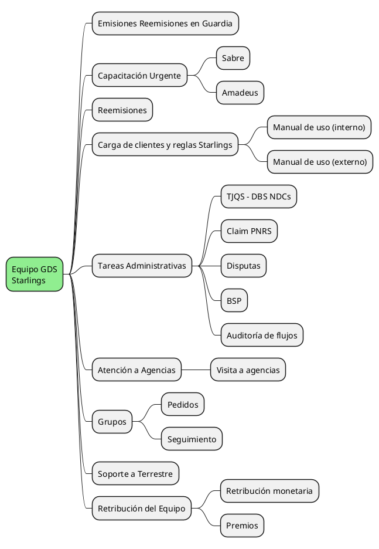

# Mapa procesos Aéreos

```plantuml
@startmindmap
*[#lightgreen] Equipo GDS\nStarlings
** Emisiones Reemisiones en Guardia
** Capacitación Urgente
*** Sabre
*** Amadeus
** Reemisiones
** Carga de clientes y reglas Starlings
*** Manual de uso (interno)
*** Manual de uso (externo)
** Tareas Administrativas
*** TJQS - DBS NDCs
*** Claim PNRS
*** Disputas
*** BSP
*** Auditoría de flujos
** Atención a Agencias
*** Visita a agencias
** Grupos
*** Pedidos
*** Seguimiento
** Soporte a Terrestre
** Retribución del Equipo
*** Retribución monetaria
*** Premios
@endmindma@startmindmap
*[#lightgreen] Equipo GDS
** Emisiones en Guardia
** Capacitación Urgente
*** Sabre
*** Amadeus
** Reemisiones
** Carga de clientes y reglas Starlings
*** Manual de uso (interno)
*** Manual de uso (externo)
** Tareas Administrativas
*** TJQS - DBS NDCs
*** Claim PNRS
*** Disputas
*** BSP
*** Auditoría de flujos
** Atención a Agencias
*** Visita a agencias
** Grupos
*** Pedidos
*** Seguimiento
** Soporte a Terrestre
** Retribución del Equipo
*** Retribución monetaria
*** Premios
@endmindmapp
```
